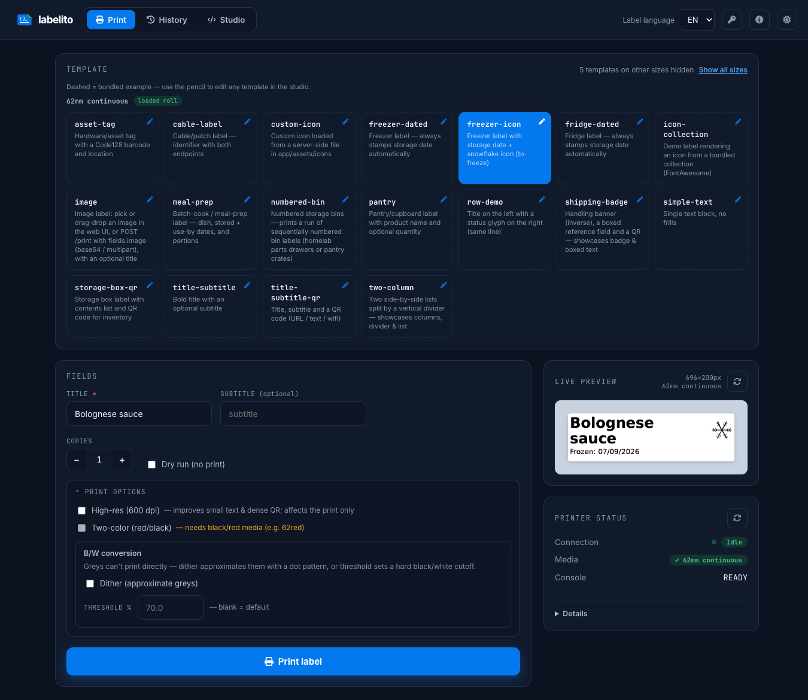

<p align="center">
  
</p>

<h1 align="center">labelito</h1>

<p align="center">
  <a href="https://github.com/chiva/labelito/actions/workflows/ci.yml"></a>
  <a href="https://github.com/chiva/labelito/releases"></a>
  <a href="https://github.com/chiva/labelito/pkgs/container/labelito"></a>
</p>

<p align="center">
  <i>labelito</i> · pronounced <b>lah-beh-LEE-toh</b> (Spanish) · IPA <code>/la.be&#712;li.to/</code><br>
  <sub>a Spanish-style diminutive of “label” — “little label”</sub>
</p>

<p align="center">
  Self-hosted label printing for <a href="https://www.brother.com/en/products/all/labelmachine/index.htm">Brother QL</a> printers.<br>
  A small container you point at your printer and drive from <b>Home Assistant</b>, a script, or the built-in web UI.<br>
  Define labels once as YAML templates; print them with one HTTP call.
</p>

<p align="center">
  <a href="https://chiva.github.io/labelito/">Website</a> ·
  <a href="https://chiva.github.io/labelito/gallery.html">Label gallery</a> ·
  <a href="https://chiva.github.io/labelito/brand.html">Brand guidelines</a>
</p>

```bash
curl -X POST http://localhost:8765/print \
  -H 'Content-Type: application/json' \
  -d '{"template":"freezer-icon","fields":{"title":"Bolognese sauce"}}'
```

→ renders a dated freezer label with a snowflake icon and prints it on your QL-810W in well under a second.

---

## What you get

- **Runs in Docker** — one `docker compose up`, non-root, `/health` + `/livez`/`/readyz` probes for your stack's health checks.
- **Home Assistant–ready** — a plain HTTP API, so a `rest_command` (or voice intent) prints a label. [Jump to the HA setup ↓](#home-assistant)
- **Web UI** — pick a template, fill the fields, see a live preview, hit print — at `http://<host>:8765`.
- **YAML templates** — drop a `.yaml` into `templates/`, hot-reload with `POST /reload`. No rebuild.
- **Auto-dated labels** — `{{date}}` / `{{date+6m}}` resolve at print time, so food-storage labels stamp themselves.
- **Knows what's loaded** — on network (SNMP) and USB printers it reads the loaded roll and **refuses a wrong-media print** instead of silently failing. [Details ↓](#printer-status--safety)

<p align="center">
  
</p>

## Quick start (Docker Compose)

The shipped `docker-compose.yml` (trimmed here — see the file for the full annotated version):

```yaml
services:
  labelito:
    build: .
    image: ghcr.io/chiva/labelito:latest
    container_name: labelito
    restart: unless-stopped
    user: "${UID:-1000}:${GID:-1000}"   # non-root; ./data must be writable by this uid
    ports:
      - "8765:8765"
    volumes:
      - ./templates:/app/templates:ro     # YOUR label templates (override slot; examples ship baked-in)
      - ./assets/icons:/app/assets/icons:ro
      - ./data:/app/data                  # print history (persistent bind mount)
    environment:
      MODEL: QL-810W
      PRINTER_URI: tcp://192.168.1.100:9100   # transport inferred from the scheme (tcp/usb/file)
      HISTORY_MODE: file                       # durable reprint/dedup on ./data
      # No default secret ships — `docker compose up` fails fast (the `${VAR:?msg}` interpolation)
      # unless API_TOKEN is set, e.g. in a .env file beside the compose file (auto-loaded).
      # Alternatives (comment out API_TOKEN, then pick one): WEB_AUTH_USER/WEB_AUTH_PASSWORD for a
      # browser login wall (HTTP Basic — protects the whole UI, no reverse proxy needed), or
      # ALLOW_UNAUTHENTICATED for a trusted LAN / behind an auth proxy. See docs/configuration.md.
      API_TOKEN: ${API_TOKEN:?Set API_TOKEN in .env, or comment this and set WEB_AUTH_USER/PASSWORD or ALLOW_UNAUTHENTICATED=true}
      # WEB_AUTH_USER: me
      # WEB_AUTH_PASSWORD: ${WEB_AUTH_PASSWORD:-}
      # ALLOW_UNAUTHENTICATED: "true"  # run open (trusted intranet only)
    healthcheck:  # dependency-aware readiness; printer reachability deliberately excluded
      test: ["CMD", "python", "-c", "import urllib.request; urllib.request.urlopen('http://localhost:8765/readyz')"]
      interval: 30s
      timeout: 5s
      retries: 3
```

Bring it up:

```bash
git clone https://github.com/chiva/labelito && cd labelito

# Keep machine-specific overrides out of the tracked compose file:
cp docker-compose.yml docker-compose.override.yml
# edit MODEL / PRINTER_URI in the override, then:

# Required: compose refuses to start without a token. To run open on a trusted LAN instead,
# comment out API_TOKEN in the compose file and uncomment ALLOW_UNAUTHENTICATED (see above).
echo "API_TOKEN=$(openssl rand -hex 16)" > .env
docker compose up -d

open http://localhost:8765          # web UI (or just visit it in a browser)
curl -s http://localhost:8765/health | python -m json.tool
```

> **Linux hosts:** the container writes print history to the bind-mounted `./data` as uid `1000`
> by default. The repo ships `data/` pre-created so it's owned by whoever cloned it — if that
> isn't uid 1000, either `chown 1000:1000 data` or run with your own ids:
> `UID=$(id -u) GID=$(id -g) docker compose up -d`.

> **Finding your printer's address.** For network models (`-W` / `-NW` / `-NWB`), use the IP from the
> printer's config printout or your router's DHCP table, with port `9100`: `tcp://<printer-ip>:9100`.
> **Pin it with a DHCP reservation** (or use a `tcp://BRWxxxxxx.local:9100` hostname) so a reboot
> doesn't change the address — see [configuration → stable addresses](docs/configuration.md#stable-printer-addresses).

USB-attached printer instead? Use `PRINTER_URI: usb://0x04f9:0x209c` and pass the USB device into the
container. Just trying it out? `PRINTER_URI: file:///tmp/out.bin` prints to a file, no hardware needed.

> **Keep it on your LAN.** The bearer token is sent in clear over plain HTTP — don't expose port
> `8765` to the public internet. Past a trusted intranet, front it with a TLS reverse proxy. More in
> [deployment & security notes](docs/configuration.md#deployment--security-notes).

## Home Assistant

Drive printing from an automation or by voice via a `rest_command`. In `configuration.yaml`:

```yaml
rest_command:
  print_label:
    url: "http://label-printer:8765/print"
    method: POST
    content_type: "application/json"
    # If API_TOKEN is set, add:  headers: { Authorization: "Bearer YOUR_TOKEN" }
    payload: >
      {"template": "{{ template }}",
       "fields": {"title": "{{ title }}", "subtitle": "{{ subtitle | default('') }}"},
       "copies": {{ copies | default(1) }}}
```

```yaml
intent_script:
  PrintFreezerLabel:
    action:
      action: rest_command.print_label
      data:
        template: "freezer-icon"
        title: "{{ label_text }}"
    speech:
      text: "Printing freezer label for {{ label_text }}"
```

Voice: *"print freezer label bolognese sauce"* → the freezer label prints, auto-dated.

## Configure

Everything is an environment variable (or a `.env` file). The handful you'll actually set:

| Variable | Default | What it does |
|---|---|---|
| `MODEL` | `QL-810W` | Your Brother QL model (any model in `brother_ql_next` — 19 supported). |
| `PRINTER_URI` | `tcp://192.168.1.100:9100` | Printer address; transport is inferred from the scheme (`tcp://` / `usb://` / `file://`). |
| `API_TOKEN` | *(unset)* | Bearer token required on all write/preview endpoints. Service **won't start** without this or `ALLOW_UNAUTHENTICATED=true`. |
| `HISTORY_MODE` | `memory` | `file` = durable reprint/dedup (Compose default), `memory` = reset on restart, `disabled` = off. |

**→ The full reference — all ~30 variables, `PRINTER_URI` formats, stable addresses, label sizes, and
history modes — is in [docs/configuration.md](docs/configuration.md).**

## Templates

A template is a YAML file in `templates/`: a media size, an optional rotation, and an ordered
**layout** of elements (title, text, qr, barcode, image, icon, lines, rows, …).

```yaml
name: freezer-icon
description: Freezer label with storage date + snowflake
label: "62"
rotate: 90
fields:
  required: [title]
  optional: [subtitle]
layout:
  - {type: icon,     name: snowflake, size: 90, align: right}
  - {type: title,    text: "{{title}}", max_lines: 2, bold: true}
  - {type: subtitle, text: "{{subtitle}}"}
  - {type: line}
  - {type: text,     text: "[[frozen]]: {{date}}", size: 30, align: center}
```

The repo ships **17 ready-to-use templates** — kitchen (`freezer-dated`, `fridge-dated`, `pantry`, …),
generic (`simple-text`, `title-subtitle-qr`, …), and homelab/logistics (`cable-label`, `asset-tag`,
`address-62x29`). These examples are **baked into the image** (at `/app/examples/templates`, outside the
`templates/` volume), so bind-mounting your own `templates/` directory — even an empty one — never
hides them, and image upgrades ship new examples automatically. Your own files are loaded alongside
and win over a bundled example of the same name. The eight shipped translation catalogs work the same
way. Prefer only your own templates? Set `LOAD_EXAMPLES=false` to skip the bundled examples entirely
(with no catalogs, `[[key]]` chrome words simply render as their raw key). Icons come from your own
`assets/icons/` or the bundled Font Awesome / Material / Octicons
collections. Labels can be multilingual (`[[token]]` chrome words, 8 languages shipped).

**→ The full template spec — every element type, tokens, rows/columns, icons, languages — is in
[docs/template-format.md](docs/template-format.md).**

## HTTP API

FastAPI serves **interactive docs at [`/docs`](http://localhost:8765/docs)** (schema at `/openapi.json`).
The endpoints you'll use most:

| Method | Path | What |
|---|---|---|
| `POST` | `/print` | Render a template and print it (`copies`, `dry_run`, `cut`, `language` options). |
| `POST` | `/preview` | Render → `image/png`, no printing. Iterate on a template without burning label stock. |
| `POST` | `/reprint/{job_id}` | Re-run a recorded job with its original date. |
| `GET` | `/printer/status` | Live printer state — loaded media, faults, identity. |
| `GET` | `/health`, `/livez`, `/readyz` | Health + Kubernetes liveness/readiness probes. |
| `POST` | `/reload` | Hot-reload templates and translations. |

Write/preview endpoints require `Authorization: Bearer $API_TOKEN` when a token is set. See
[`/docs`](http://localhost:8765/docs) for the complete list, request bodies, and response schemas.

`/print` and `/preview` normally reference a stored template by name. Set
`INLINE_TEMPLATES_ENABLED=true` to also submit a full template body inline via `template_inline` —
letting a client or git repo hold templates off-platform and print them with no save step. The body
is validated exactly like a stored file and frozen into history so `/reprint` reproduces it. See
[docs/template-format.md](docs/template-format.md#inline-templates-printing-without-storing).

## Printer status & safety

Brother's **network** printers have a silent back-channel: the NIC accepts a `:9100` print job and the
bytes, but never returns the status frame — so a job rejected by the hardware (most often a **loaded
roll that doesn't match the template**) makes the printer blink red while the call still reports `200`.

labelito closes this using the printer's real status channel — **SNMP** (UDP 161) on the network and a
standalone **ESC i S** query on USB. `/print` and `/reprint` read the loaded roll first and reject a
mismatch with **`409 Conflict`**; the web UI flags it advisorily. If the status channel is unreachable
(or `SNMP_ENABLED=false`), the guard **fails open** — it never turns a working print into a hard
failure. Full details and the verified OID map: [docs/snmp-status.md](docs/snmp-status.md).

## More docs

- [Configuration reference](docs/configuration.md) — every env var, `PRINTER_URI` formats, label sizes, history modes.
- [Template format](docs/template-format.md) — elements, tokens, rows/columns, icons, languages.
- [Printer status & the media guard](docs/snmp-status.md) — SNMP/USB status, the 409 guard, OID map.
- [Known limitations](docs/known-limitations.md) — the silent back-channel, reprint/dedup semantics, single-worker assumptions.
- [Development guide](docs/development.md) — dev container, local setup, tests, project layout.
- [Contributing](CONTRIBUTING.md) — adding printer models/drivers and languages, PR checklist.

## Development

Uses [**uv**](https://docs.astral.sh/uv/) for dependencies and [hatchling](https://hatch.pypa.io/) for
builds; Python **3.12+**.

```bash
uv sync                       # create .venv, install all groups
uv run pre-commit install     # lint/format/type hooks on commit

# Run locally with no printer (file:// sink):
PRINTER_URI=file:///tmp/out.bin uv run uvicorn app.main:app --reload --port 8765

uv run pytest -m "not hardware"                          # test suite (skips hardware-only tests)
uv run ruff check . && uv run mypy app/                  # lint + strict types
```

New here? [docs/development.md](docs/development.md) is the full onboarding guide, and a VS Code /
Codespaces **dev container** (`.devcontainer/`) provisions everything in one click.

## License

[GPL-3.0-or-later](LICENSE). This is required: the service imports `brother_ql` (via
`brother_ql_next`), which is GPL-3.0-or-later, pinning the combined work to GPL regardless of
individual file headers. Contributions are inbound = outbound under the same license.
